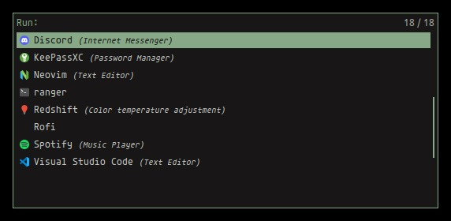

# 🐉 Kanagawa Rofi



Dark color scheme inspired by the colors of the famous painting by Katsushika Hokusai for Rofi.
This theme is based on the [https://github.com/rebelot/kanagawa.nvim](Kanagawa) color palette.

## 🔩 Installation

Add the kanagawa.rasi file to your Rofi theme folder. This command will create it if it does
not exist for you yet:

```
mkdir -p ~/.local/share/rofi/themes
```

Insert the theme there, then run `rofi-theme-selector` and select the kanagawa by u16ptr theme.
You can also run this command, which creates a folder and downloads the theme file to it via cURL:

```
mkdir -p ~/.local/share/rofi/themes &&
curl https://raw.githubusercontent.com/u16ptr/kanagawa-rofi/refs/heads/main/kanagawa.rasi -o ~/.local/share/rofi/themes/kanagawa.rasi
```

## 📕 Modifying the Font

You can change the font in the `configuration` of the `kanagawa.rasi` file.
